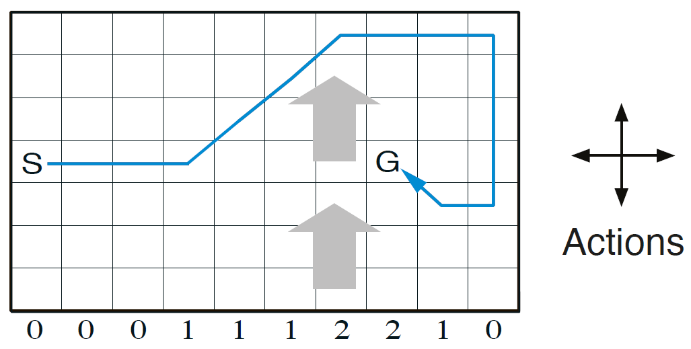

## CS 747 Programming Assignment 3: Windy Gridworld Problem

This is an implementation of Example 6.5, Exercise 6.9 and Exercise 6.10 from the book [Reinforcement Learning: An Introduction by Andrew Barto and Richard S. Sutton](https://web.stanford.edu/class/psych209/Readings/SuttonBartoIPRLBook2ndEd.pdf "Reinforcement Learning: An Introduction"). This work also compares the performance of Sarsa, Q-Learning and Expected Sarsa with Full Bootstrapping.  

<!--  -->


The following tasks have been implemented:  
-  **Task 2**: Sarsa(0) with constant wind and 4 moves (baseline)  
-  **Task 3**: Sarsa(0) with constant wind and King's moves (8 moves total)  
-  **Task 4**: Sarsa(0) with stochastic wind and King's moves  
-  **Task 5**: Comparision of Sarsa, Q-Learning and Expected Sarsa with Full Bootstrapping

How to use the main.py script:
```
usage: main.py [-h] [--task TASK] [--stochastic STOCHASTIC]
               [--kingsmoves KINGSMOVES] [--algorithm ALGORITHM]

optional arguments:
  -h, --help            show this help message and exit
  --task TASK, -t TASK  Task number from {2,3,4,5}
  --stochastic STOCHASTIC, -s STOCHASTIC
                        Include stochastic wind or not. Enter 0 or 1
  --kingsmoves KINGSMOVES, -k KINGSMOVES
                        Allow King's moves or not. Enter 0 or 1
  --algorithm ALGORITHM, -a ALGORITHM
                        Choices are from {sarsa, expected-sarsa, q-learning,
                        compare}. 'compare' will compare all three algorithms
                        on a plot
```  

To the run the program on your machine, navigate to this folder in bash/cmd and run according to any of the following examples:
```bash
python main.py --task 2 # runs task 2
# or
python main.py # runs task 5 by default
# or
python main.py --algorithm expected-sarsa --stochastic 0 --kingsmoves 1
# or 
python main.py -a expected-sarsa -s 0 -k 1 # same fucntionality as above
# or 
python main.py -a compare -s 1 -k 0 # compares all 3 algos under given conditions
```
Either of these will run the agent for 200 episodes and generate the plot of episodes vs cumulative time-steps.  

***Note 1: EITHER -t, OR -a, -s and -k flags need to be passed. No other combinations are allowed.***  
***Note 2: If the code is being run on a cs747 docker container, plt.show() won't show the plot. Plots can be found in the plots directory then.***

Hyper Parameters Used: 
```python
alpha = 0.5 # learning rate
epsilon = 0.1 # for epsilon-greedy choice
gamma = 1 # no discounting 
reward = -1 # on every time step. To incentivise for faster convergences
```